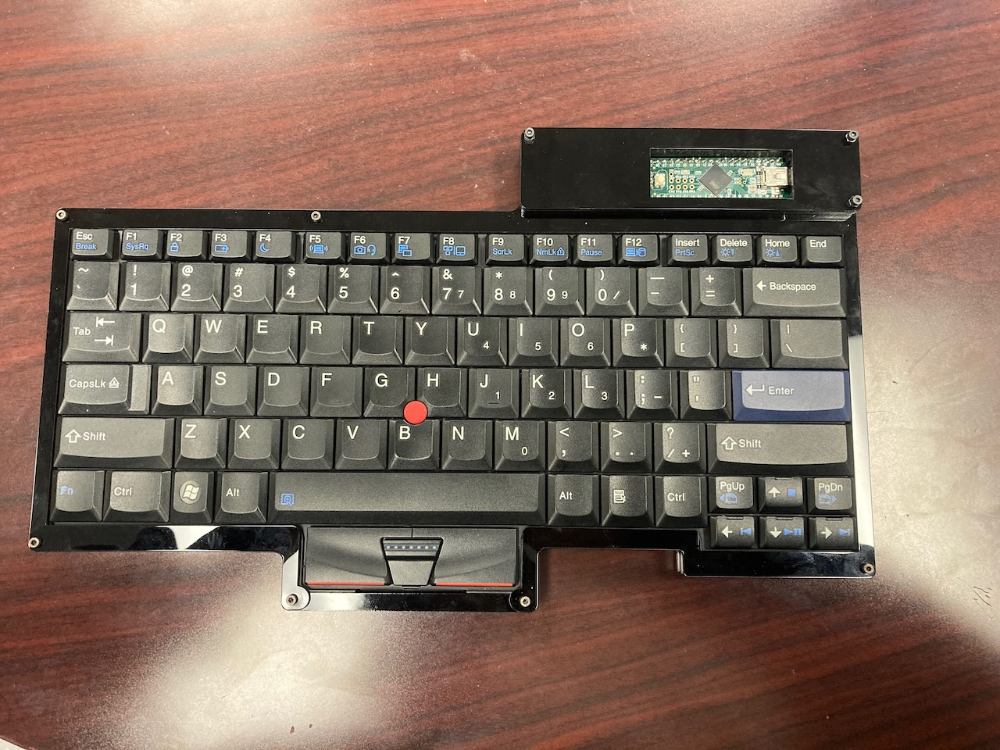
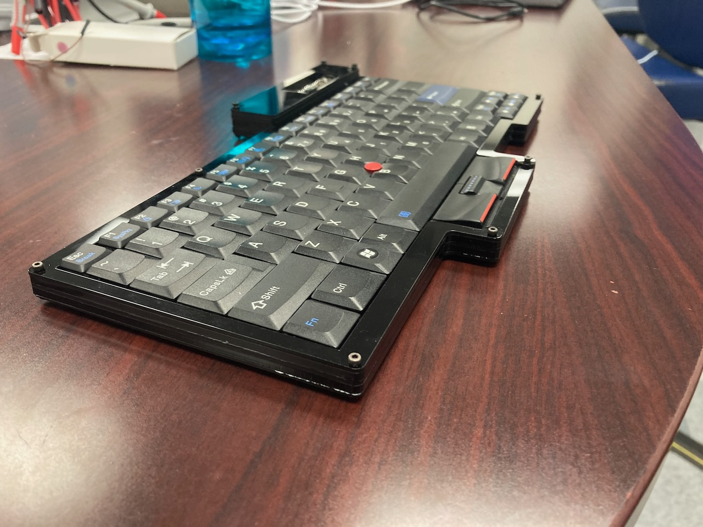
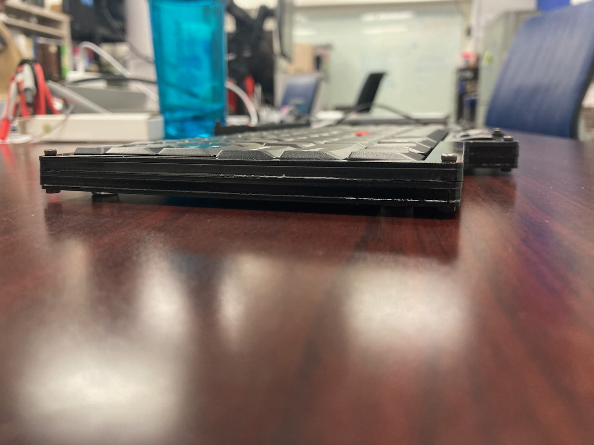
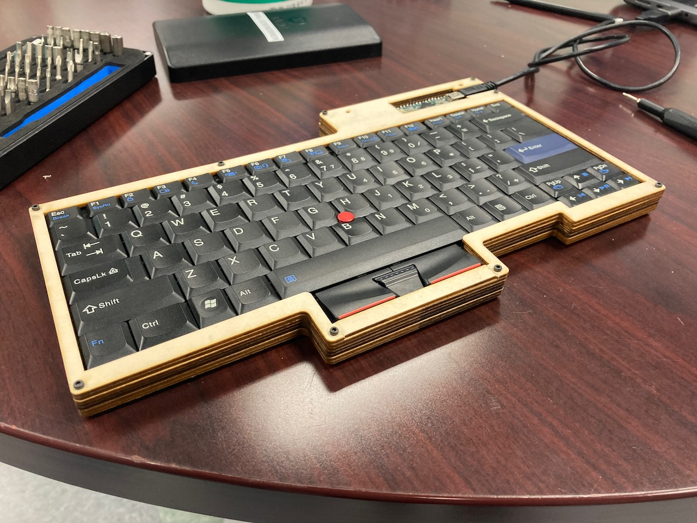

# tp-keyboard


<br>

The goal of this project is to make a useable desktop keyboard from the keyboard of the ThinkPad L420. It uses a custom PCB to connect to the FFC cables of the keyboard matrix and trackpoint module to a Teensy++ board.

The Teensy++ runs QMK firmware to scan the keyboard matrix and read the signals from the trackpoint module. QMK has a PS/2 library which is used to make the trackpoint module functional.

<br>

<details>
  <summary>More Pictures</summary>

  
  
  
  
</details>  

<br>

## Trackpoint
The trackpoint module has an 8 pin FFC cable.

The modules clock pin needs to connect to PD2 and data pin needs to connect to PD5 of the teensy


<br>

## Keyboard Matrix
The keyboard has a 30 pin FFC cable connected to it. These are the rows and column pins for the matrix


<br>

## Housing
The housing is comprised of laser cut wood/acrylic sheets (1.5mm and 3mm) and M2 screws.

This is the stackup I used. However thicknesses can be varied to make the keyboard lower or higher profile.
```
[      shield_2.dxf (1.5mm)      ]
[      shield_1.dxf (1.5mm)      ]
[      shield_1.dxf (3.0mm)      ]
[       layer4.dxf (1.5mm)       ]
[  layer3 cover ffc.dxf (3.0mm)  ]
[       layer2.dxf (3.0mm)       ]
[    layer2_nousb.dxf (1.5mm)    ]
[       layer1.dxf (1.5mm)       ]
```
Some notes about the housing:
* ```layer2_nousb.dxf``` has no usb cutout while laye2.dxf has a cut out for usb. These allow for adjusting when the usb cut-out starts.
* layer2 has to have enough space for the PCB, so it cannot be too thin, in my case 1.5mm + 3.0mm was enough clearance
* ```layer3 cover ffc.dxf's``` thickness should try to match the height of the edge of the keyboard matrix module. This is because the keyboard module lays ontop of layer2 and layer3 cover ffc goes along the edges of the keyboard module. layer4 goes ontop and helps secure/hold down the keyboard module. If the layer3 section is too thick, then the edges of the keyboard module wont be secured leading to more wobble. If the layer3 section is too thin, the keyboard will be held down, but layer4 would not be able to sit flush. If layer 3 is the right height then there would be some pressure holding the keyboard down and layer4 would sit flush.
* ```layer4.dxf``` is better if it is thinner (1.5mm) so fingers dont hit it when using keys on the edges
* ```layer1.dxf``` [WIP] there is a hole in the middle to secure the keyboard down, it goes into the screwhole in the back of the keyboard module, this helps with wobble when using the trackpoint

Other than these notes, the thicknesses of each layer can be adjusted.

<br>

## Parts
* Keyboard from L420 or similar: SL410 L410 L412 L420 L421 L510 L512 L520 SL410 SL410K SL510 SL510K I think these also work.
* Trackpoint from r61 keyboard module or similar
* Acrylic sheets or wood for housing, I used 3mm (1/8inch) and 1.5mm (1/16in) thick sheets
* Teensy++ (https://www.pjrc.com/store/teensypp.html)
* PCB
* Trackpoint connector (https://www.digikey.com/short/2vzz139r) (Part #: 84981-8)
* Keyboard FFC connector (https://www.digikey.com/short/30qq3210) (Part #: 	
FFC3B07-30-T)
* 4.7K(2) and 100K Resistor (1206)
* 2.2uF Cap (1206)
* M2 Screw kit. (With sizes like 4mm /6mm /8mm /10mm /12mm /16mm /20mm) can be found on Amazon

<br>

## Breakout board

This is the dev board I created and used to decode the matrix of the keyboard.


## Helpful resources:
* https://qmk.fm/ (qmk firmware)
* https://www.pjrc.com/store/teensypp.html (teensy++ 2.0)
* http://pcbheaven.com/wikipages/How_Key_Matrices_Works/ (Keyboard matrix info)
* https://deskthority.net/wiki/TrackPoint_Hardware (Trackpoint module pinouts)
* https://www.instructables.com/id/How-to-Make-a-USB-Laptop-Keyboard-Controller/ (How to decode a keyboard matrix)
* https://docs.qmk.fm/#/feature_ps2_mouse?id=the-cirtuitry-between-trackpoint-and-controller (Trackpoint wiring)
* https://beta.docs.qmk.fm/for-makers-and-modders/hand_wire (How to creat firmware with QMK)
* https://deskthority.net/wiki/MX13_SpaceSaver_Keyboard (Example of kb with teensy++ and trackpoint)

